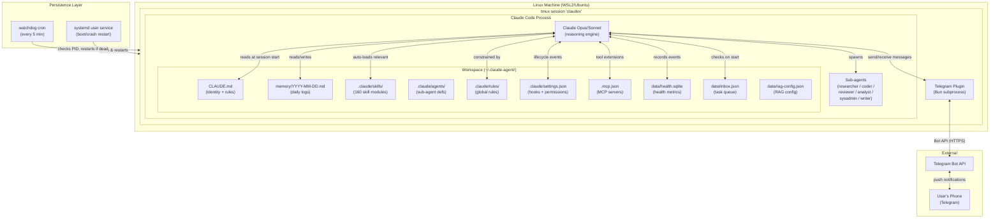
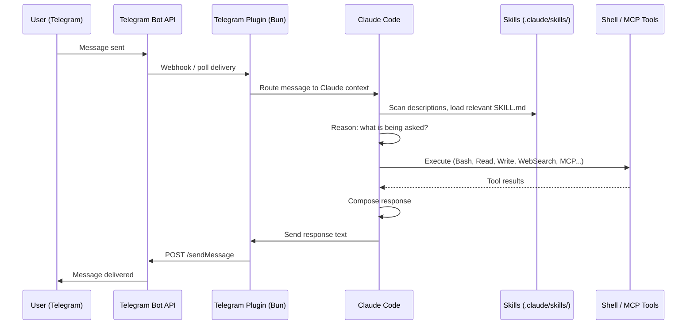
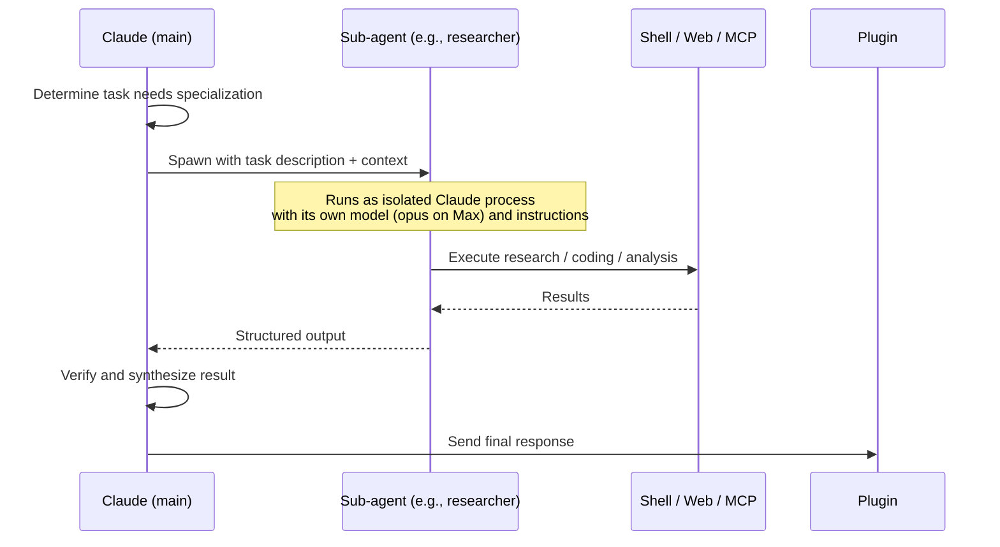
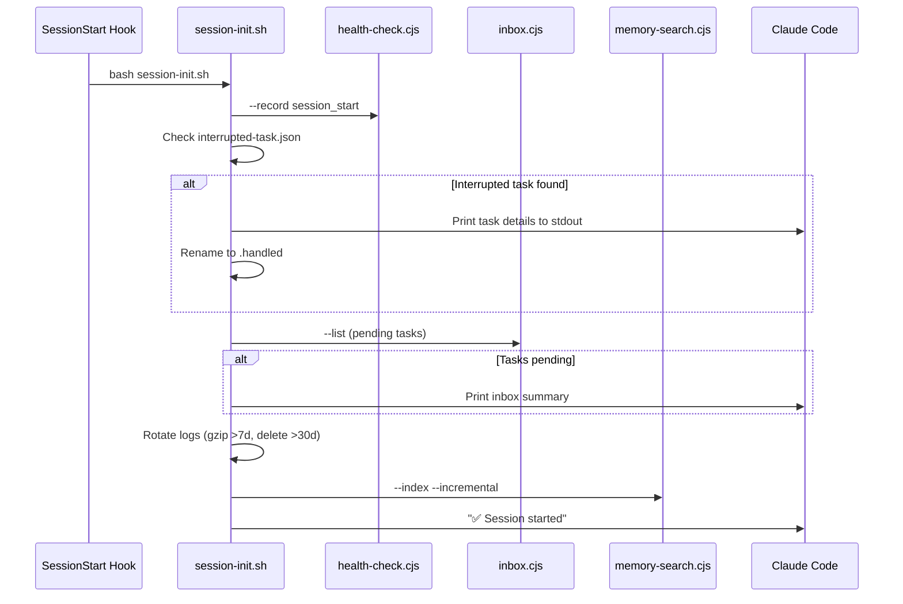
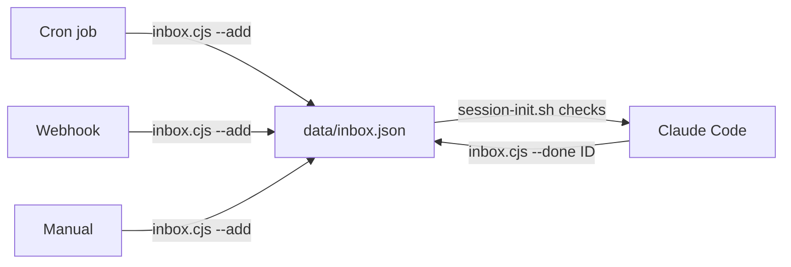

# Claudex Architecture

> The complete architecture reference for the Claudex autonomous agent system.

---

## 1. System Overview

Claudex is a **persistent, Telegram-connected autonomous AI agent** built on two core primitives: [Claude Code](https://docs.anthropic.com/en/docs/claude-code) (Anthropic's official agentic CLI) and a **Claude Max subscription** ($100/mo flat rate). It runs as a 24/7 daemon on a Linux machine — tested on WSL2/Ubuntu — and gives you a fully autonomous AI agent reachable via Telegram, with no per-token API billing.

The system is designed around one insight: Claude Code is not just a coding assistant. It's a general-purpose agentic runtime with a hook system, sub-agent support, skill loading, MCP server integration, and permission modes that — when combined with the right workspace layout — produce a capable autonomous AI agent indistinguishable in power from bespoke agent frameworks.

Key properties:
- **Always on.** Three-layer persistence (tmux → systemd → watchdog cron) keeps it running through crashes, reboots, and SSH disconnects.
- **Telegram-native.** Two-way real-time messaging via the official Telegram channel plugin running on Bun.
- **Skill-equipped.** 160 portable skill modules that Claude auto-selects based on task description.
- **Sub-agent capable.** Specialized agents (researcher, coder, reviewer, etc.) handle parallel delegated work.
- **Memory-persistent.** File-based memory system ensures continuity across restarts.
- **Zero API cost.** Claude Max subscription covers all usage; no per-token billing surprises.

---

## 2. Component Diagram



**Reading the diagram:** The user's phone sends a Telegram message → Telegram API delivers it to the plugin subprocess (running Bun) → Claude Code receives and processes it → may load skills, spawn sub-agents, run tools → response travels back through the same chain.

The systemd service and watchdog cron are the outer shell. If the tmux session dies, systemd restarts it. If systemd fails or the process is zombie, cron catches it every 5 minutes.

---

## 3. Data Flow

### Normal Message Flow



**Skill selection** happens implicitly: Claude Code scans `SKILL.md` files in `.claude/skills/` and loads those whose `description` frontmatter field matches the current task context. This is description-based inference, not explicit routing — Claude decides which skills are relevant.

### Sub-agent Delegation Flow

When a task is complex, parallel, or specialized, Claude delegates to a sub-agent:



Sub-agents run as separate Claude processes with their own model (on Max subscription, all use `opus` since there's no per-token cost), tool scopes, and specialized system prompts defined in `.claude/agents/<name>.md`.

### Session Startup Flow

When a new session begins, the SessionStart hook triggers initialization:



---

## 4. Identity System

### CLAUDE.md: The Single-File Identity

In Claudex, all identity, personality, user context, and operating rules live in a single file: `CLAUDE.md`. This is loaded at every session start and stays in Claude's context window throughout the session.

CLAUDE.md is structured in semantic sections:

```markdown
## Who You Are          ← personality, name, voice
## About Your Human     ← user preferences, timezone, communication style
## Operating Rules      ← autonomy level, memory habits, safety rules
## Memory System        ← how to use memory files
## Key Projects         ← project locations and context
## Tools & Environment  ← preferred CLI tools, OS notes
## Sub-agents           ← available agents and when to use them
## Security             ← what never to do
```

### Mapping to OpenClaw's Multi-File System

OpenClaw splits identity across multiple files for separation of concerns. Claudex collapses them into one:

| OpenClaw File | Claudex Equivalent | Purpose |
|---|---|---|
| `SOUL.md` | `CLAUDE.md` — "Who You Are" section | Personality, voice, character |
| `USER.md` | `CLAUDE.md` — "About Your Human" section | User preferences and context |
| `AGENTS.md` | `CLAUDE.md` — "Operating Rules" section | How to behave autonomously |
| `IDENTITY.md` | `CLAUDE.md` — top section | Name, role, vibe |
| `MEMORY.md` | Claude Auto-Memory + `memory/*.md` | Long-term curated memories |
| `TOOLS.md` | `.claude/CLAUDE.md` or inline sections | Environment-specific notes |
| `HEARTBEAT.md` | Scheduled tasks + `/loop` | Periodic check instructions |

### Tradeoff: Single File vs. Multi-File

**Single file (Claudex):**
- ✅ Simpler: one place to edit everything
- ✅ No loading logic: always in context
- ✅ Easier to reason about what Claude "knows"
- ❌ Gets large over time; harder to update individual sections
- ❌ No selective loading (always loads everything)

**Multi-file (OpenClaw):**
- ✅ Modular: update personality without touching rules
- ✅ Selective loading (e.g., MEMORY.md only in main session)
- ✅ Better for teams or shared contexts (load only what's needed)
- ❌ More moving parts; requires a loader/injection system
- ❌ Risk of inconsistency between files

For a single-user autonomous agent, Claudex's single-file approach is simpler and sufficient. The multi-file approach pays off when you need security boundaries (e.g., not loading personal MEMORY.md in group chats — something OpenClaw enforces by design).

---

## 5. Skill System

### Skill Structure

Each skill is a directory under `.claude/skills/` containing a `SKILL.md` file with YAML frontmatter:

```
.claude/skills/
├── weather/
│   └── SKILL.md
├── github-workflow/
│   └── SKILL.md
├── web-monitor/
│   └── SKILL.md
└── system-admin/
    └── SKILL.md
```

A minimal skill:

```markdown
---
name: weather
description: Get current weather and forecasts. Use when the user asks about weather,
             temperature, or forecasts for any location.
---

# Weather Skill

Fetch weather using wttr.in:

\```bash
curl -s "wttr.in/LOCATION?format=%l:+%c+%t+%h+%w"
\```
```

The `description` field is critical — it's what Claude reads to decide whether to load this skill for a given task. Think of it as the skill's intent signal.

### Auto-selection Mechanism

Claude Code scans all `SKILL.md` files in `.claude/skills/` and loads those whose description matches the current task context. This happens implicitly during reasoning — Claude decides which skills are relevant without explicit routing logic. There is no dispatcher, no classifier, no hard rules. Description quality determines selection accuracy.

**Best practices for skill descriptions:**
- Be specific about *when* to use it: "Use when the user asks about X"
- Include synonyms: "weather, temperature, forecast, rain"
- Keep it one sentence; frontmatter isn't prose

### Contrast with OpenClaw

OpenClaw injects a list of available skills into the context as XML:

```xml
<available_skills>
  <skill name="weather" description="Get weather forecasts..."/>
  <skill name="tts" description="Convert text to speech..."/>
  ...
</available_skills>
```

Claude then explicitly selects from this list. The difference:

| | Claudex | OpenClaw |
|---|---|---|
| **Selection mechanism** | Implicit (description matching during reasoning) | Explicit (from injected XML list) |
| **Discovery** | Claude scans filesystem | System injects list at session start |
| **Skill content** | Full SKILL.md loaded when relevant | Fetched on demand via tool call |
| **Failure mode** | Poor descriptions → skills ignored | Missing from list → skills invisible |
| **New skills** | Drop file, auto-available immediately | May require registration/restart |

Both work. OpenClaw's explicit list gives more control; Claudex's filesystem scan is lower ceremony.

---

## 6. Sub-agent Architecture

### Custom Agent Definitions

Sub-agents are defined as markdown files with YAML frontmatter in `.claude/agents/`:

```markdown
---
name: researcher
description: Deep research tasks — web search, multi-source analysis, report writing.
             Use for any research request that requires thoroughness.
model: opus
---

You are a research agent. Given a topic:
1. Search multiple sources for information
2. Cross-reference findings
3. Synthesize into a clear, structured summary

Be thorough but concise. Cite sources. Flag uncertainty.
```

The `model` field allows overriding the model per agent. On a Max subscription, all agents use `opus` since there's no per-token cost. On API billing, you'd typically set sub-agents to `sonnet` or `haiku` to save cost.

### Available Custom Agents

| Agent | Model | Purpose |
|---|---|---|
| `researcher` | Opus | Multi-source research, analysis, report writing |
| `coder` | Opus | Feature implementation, bug fixes, refactoring |
| `reviewer` | Opus | Code review, PR analysis, quality checks |
| `analyst` | Opus | Data analysis, market research, metrics |
| `sysadmin` | Opus | Infrastructure management, diagnostics |
| `writer` | Opus | Documentation, reports, plans, summaries |

### Built-in Agents

Claude Code ships with two built-in agents that don't require definition files:
- **Explore agent** — filesystem and codebase exploration
- **Plan agent** — task decomposition and planning

### Agent Teams (Experimental)

Enabled via environment variable in `settings.json`:

```json
{
  "env": {
    "CLAUDE_CODE_EXPERIMENTAL_AGENT_TEAMS": "1"
  }
}
```

Agent Teams is an experimental multi-agent coordination feature that allows agents to share task lists and communicate directly. Unlike independent sub-agent spawning (where the main agent delegates and waits), Teams allows agents to coordinate in parallel with shared context. This is not yet stable and the API/behavior may change.

---

## 7. Persistence Architecture

Three independent layers ensure the agent runs 24/7, each covering a different failure mode:

```
loginctl enable-linger
  └── systemd --user (survives logout, restarts on crash)
        └── tmux session "claudex" (survives SSH disconnect)
              └── claude code process (the agent itself)
                    └── telegram plugin (bun subprocess)

cron (every 5 min) ──► pgrep check ──► restart if dead
```

### Layer 1: tmux Session

**Failure mode covered:** SSH/terminal disconnect.

Claude Code requires a TTY (pseudo-terminal). Running it directly in a shell means it dies when the SSH session closes. tmux creates a persistent session that survives disconnects:

```bash
tmux new-session -d -s claudex
tmux send-keys -t claudex "claude --channels plugin:telegram@claude-plugins-official ..." Enter
```

The `start-claudex.sh` script handles this — it checks if the session exists and either attaches or creates it.

### Layer 2: systemd User Service

**Failure mode covered:** Machine reboot, process crash.

The systemd user service (`~/.config/systemd/user/claudex.service`) starts on boot and restarts on failure:

```ini
[Service]
Type=simple
WorkingDirectory=%h/.claude-agent
ExecStart=%h/.claude-agent/scripts/start-claudex.sh
Restart=on-failure
RestartSec=30
Environment=HOME=%h
Environment=PATH=%h/.bun/bin:%h/.local/bin:%h/.cargo/bin:/usr/local/bin:/usr/bin:/bin
KillMode=process
TimeoutStopSec=30
```

`%h` is systemd's specifier for the running user's home directory — no hardcoded paths needed.

`KillMode=process` prevents systemd from killing the entire tmux session when stopping (important for graceful shutdown). `RestartSec=30` gives a cooldown to avoid restart storms.

**Critical:** `loginctl enable-linger $USER` must be run once. Without it, systemd user services are tied to the login session and die when you log out — defeating the purpose.

### Layer 3: Watchdog Cron

**Failure mode covered:** Zombie processes, systemd restart limit exhaustion, Telegram plugin channel rot, and silent delivery failures.

The watchdog cron runs every 5 minutes and performs **three checks**:

```bash
# crontab entry
*/5 * * * * bash ~/.claude-agent/scripts/watchdog-claudex.sh
```

**Check 1 — Process alive?**
Basic `pgrep` check. Restart if the Claude process is gone.

**Check 2 — Session age (72h limit)**
Tracks when the session started via `data/watchdog_session_start`. If the session has been running for more than 72 hours, it proactively restarts with a fresh session. This prevents the Telegram plugin's outbound MCP channel from silently corrupting over time — a known failure mode in long-running sessions.

**Check 3 — Telegram delivery health**
Counts files in `~/.claude/channels/telegram/inbox/`. If new inbound messages arrive but no delivery is confirmed after 10 minutes, the watchdog checks the tmux pane for active work indicators (`✻`, `Running`, `Executing`, etc.):
- **If actively working** → skip restart, keep waiting. Long tasks (30+ minutes) are safe.
- **If idle at prompt** → restart. The outbound channel is stuck.

This prevents the case where the process is technically alive but Claude's responses never reach Telegram.

The watchdog also records health metrics: `watchdog_ok` when the process is alive, `restart` when it triggers a recovery. These events feed into `health-check.cjs --report` for uptime tracking.

### Why All Three?

| Layer | Survives |
|---|---|
| tmux | Terminal/SSH disconnect |
| systemd | Reboot, process crash, user logout (with linger) |
| watchdog cron | Zombie processes, systemd restart limit, uncaught edge cases |

Each layer is cheap to maintain and covers gaps the others miss. Together they provide robust 24/7 uptime without complex orchestration.

---

## 8. Memory Architecture

Claudex uses a three-tier file-based memory system:

### Tier 1: Permanent Identity (CLAUDE.md)

`CLAUDE.md` is the agent's DNA — personality, rules, user context. It rarely changes and provides stable identity across all sessions. This is not "memory" in the conversational sense; it's the fixed configuration that makes the agent *who it is*.

### Tier 2: Daily Logs (memory/YYYY-MM-DD.md)

Daily markdown files capture what happened: decisions made, tasks completed, problems encountered, things to remember tomorrow. At session start, the agent reads recent files (today + yesterday) to restore working context:

```
memory/
├── 2026-04-06.md    ← 2 days ago
├── 2026-04-07.md    ← yesterday (read at start)
└── 2026-04-08.md    ← today (read at start, written to during session)
```

The agent writes to today's file proactively during work, not just at end-of-session. The operating rules in CLAUDE.md explicitly say: *"Write things down. Files survive restarts; mental notes don't."*

### Tier 3: Claude Auto-Memory

Claude Code has a built-in auto-memory mechanism that persists key learnings and preferences across sessions automatically — without requiring the agent to explicitly write a file. This captures patterns like "user prefers bullet lists over tables in Telegram" or "project X uses bun, not npm."

Auto-memory complements daily logs: logs are explicit and agent-controlled; auto-memory is implicit and model-driven.

### Embedding Providers

The RAG system supports three embedding providers with automatic fallback:

| Provider | Quality | Cost | Requirements |
|----------|---------|------|-------------|
| **OpenAI** (`text-embedding-3-small`) | Best | ~$0.02/mo | `OPENAI_API_KEY` env var |
| **Ollama** (`nomic-embed-text`) | Good | Free | Ollama running locally |
| **TF-IDF** (feature hashing) | Decent | Free | Nothing — pure Node.js |

Auto-detection chain: OpenAI → Ollama → TF-IDF. Override with `CLAUDEX_EMBEDDING_PROVIDER`.

The embedding cache stores the provider key (`openai:text-embedding-3-small`, `ollama:nomic-embed-text`, `tfidf:v1`) per entry. When searching, chunks from a different provider than the current one get vector score 0 and fall back to FTS-only scoring. A full reindex after switching providers is recommended.

Cross-agent directory paths are configured in `data/rag-config.json` (created via `--init-config`), making the system portable across installations.

### Memory Comparison

| Type | Controlled by | Persists | Best for |
|---|---|---|---|
| CLAUDE.md | Human (manual edit) | Forever | Identity, rules, stable context |
| memory/*.md | Agent (writes files) | Until deleted | Daily work, decisions, reminders |
| Auto-memory | Claude Code (implicit) | Cross-session | Learned preferences, patterns |

---

## 9. Hook System

Hooks execute shell commands at lifecycle events. They're defined in `.claude/settings.json` under the `hooks` key.

### Available Hook Events

| Event | Fires when | Production use |
|---|---|---|
| `SessionStart` | Claude Code session begins | `session-init.sh` — health event, interrupted task check, inbox scan, log rotation, memory reindex |
| `PostToolUse` | After a tool call completes | Auto-stage git changes on `Write\|Edit` |
| `Stop` | Session ends | `session-shutdown.sh` — save interrupted state, record health event |

### Hook Format

⚠️ **Critical gotcha:** Hooks use a nested structure with a `matcher` field. The flat format silently fails.

```json
{
  "hooks": {
    "SessionStart": [
      {
        "matcher": "",
        "hooks": [
          {
            "type": "command",
            "command": "echo \"[$(date '+%Y-%m-%d %H:%M')] Session started\" >> logs/sessions.log"
          }
        ]
      }
    ]
  }
}
```

**Correct structure:** `{ matcher, hooks: [{ type, command }] }`  
**Wrong structure:** `[{ type: "command", command: "..." }]` at the top level

The `matcher` field filters which events trigger the hook. An empty string (`""`) matches all events. For `PostToolUse`, you can match specific tool names:

```json
{
  "matcher": "Write|Edit",
  "hooks": [{ "type": "command", "command": "git add -A" }]
}
```

### Production Hook Setup

The template `settings.json` ships with two hooks:

1. **SessionStart** — logs session start time to `logs/sessions.log`
2. **Stop** — logs session stop time to `logs/sessions.log`

These provide a lightweight audit trail of when the agent was running, useful for debugging restarts and uptime tracking.

---

## 10. Security Model

### Permission Modes

Claude Code supports three permission modes, set in `settings.json`:

| Mode | Description | When to use |
|---|---|---|
| `default` | Prompts for confirmation on sensitive operations | Interactive use, low-trust environments |
| `plan` | Read-only planning mode; no writes/executes | Auditing, untrusted tasks |
| `bypassPermissions` | No prompts; executes everything | Isolated environments (WSL2), autonomous daemons |

Claudex production config uses `bypassPermissions` because:
1. The agent runs in an isolated WSL2 environment with no direct internet exposure
2. Autonomous operation requires zero interactive prompts (prompts block restart loops)
3. The access control is at the Telegram layer, not the execution layer

### Tool-Level Allowlists

Even in `bypassPermissions` mode, you can restrict which tools are available via the `allow` list:

```json
{
  "permissions": {
    "defaultMode": "bypassPermissions",
    "allow": [
      "Bash(*)",
      "Read(*)",
      "Write(*)",
      "Edit(*)",
      "Grep(*)",
      "WebSearch(*)"
    ]
  }
}
```

Tools not in the allowlist are unavailable regardless of mode. This provides defense-in-depth even with bypass enabled.

### Telegram Access Control

The Telegram plugin enforces its own access layer:
- **Allowlist mode** — only whitelisted Telegram user IDs can send messages
- **Pairing** — accounts must be explicitly paired before allowlisting
- Config lives at `~/.claude/channels/telegram/access.json` (user-level, not workspace-level)

### WSL2 Isolation

The recommended deployment in WSL2 provides OS-level isolation:
- No direct internet exposure (NAT'd behind the host)
- Separate filesystem from the Windows host
- `bypassPermissions` is appropriate: the blast radius of any mistake is contained to the WSL2 instance

### Key Security Rules in CLAUDE.md

The identity file enforces additional behavioral constraints:
- Never expose API keys, tokens, or passwords in responses
- Use `trash` over `rm` (recoverable deletions)
- Never push secrets to git
- Ask before any action that leaves the machine (email, tweets, public posts)

---

## 11. Comparison: Claudex vs OpenClaw vs Vanilla Claude Code

| Feature | Claudex | OpenClaw | Vanilla Claude Code |
|---|---|---|---|
| **Cost model** | Flat $100/mo (Max subscription) | Variable API billing | Variable API billing |
| **Context window** | 1M tokens (Opus via Max) | ~200K (API) | ~200K (API) |
| **Telegram** | ✅ Native plugin | ✅ Native | ❌ |
| **Discord** | ✅ Plugin | ✅ Native | ❌ |
| **WhatsApp / Signal / Slack** | ❌ | ✅ Native | ❌ |
| **Multi-channel** | Limited (Telegram + Discord) | Full (6+ channels) | ❌ |
| **Mobile control** | claude.ai Remote Control | Telegram only | ❌ |
| **Paired nodes (phone/camera)** | ❌ | ✅ | ❌ |
| **Browser control** | Bash + Playwright | Playwright + Chrome relay | Bash only |
| **Canvas (inline UI)** | ❌ | ✅ | ❌ |
| **TTS** | Via MCP / Bash | ✅ Built-in | ❌ |
| **Image analysis** | Via API / MCP | ✅ Built-in | ❌ |
| **Skill system** | ✅ Description-based auto-select | ✅ XML injection | ❌ |
| **Skill marketplace** | Manual (160 in this repo) | ClawHub (install/publish) | ❌ |
| **Sub-agents** | ✅ Built-in (model override) | ✅ sessions_spawn | ❌ |
| **Agent Teams** | ✅ Experimental | ❌ | ❌ |
| **Identity system** | Single file (CLAUDE.md) | Multi-file (SOUL/USER/AGENTS/IDENTITY) | CLAUDE.md only |
| **Memory** | Daily files + auto-memory | MEMORY.md + daily files | None |
| **Hook system** | ✅ Rich (SessionStart/Stop/PostToolUse) | Limited | ❌ |
| **Heartbeat system** | Approximated (scheduled tasks) | ✅ Native (HEARTBEAT.md) | ❌ |
| **Persistence** | tmux + systemd + watchdog | Gateway daemon | Manual |
| **Persist through logout** | ✅ loginctl linger | ✅ Gateway daemon | ❌ |
| **MCP servers** | ✅ .mcp.json | ✅ | ✅ |
| **Permission modes** | bypassPermissions / allowlist | Policy-based | Prompt-based |
| **Setup complexity** | Low (clone, configure, run) | Medium (gateway + config) | None (just install) |
| **Infrastructure required** | None beyond Linux + Claude | Gateway daemon + ports | None |
| **Web search** | Via MCP or Bash | ✅ Built-in (Brave API) | ❌ |
| **Cross-session communication** | ❌ (independent sessions) | ✅ sessions_list/send | ❌ |
| **Secret management** | Env vars + manual | Built-in | ❌ |
| **Reactions / rich messaging** | Basic send/receive | Reactions, polls, buttons, effects | ❌ |

### Decision Guide

**Choose Claudex if:**
- You want zero API cost and maximum context (1M tokens)
- Primary interface is Telegram
- You want simple setup with no gateway infrastructure
- Single-user autonomous agent on an isolated Linux machine

**Choose OpenClaw if:**
- You need multi-channel (WhatsApp, Discord, Signal, Slack, etc.)
- You want paired device control (camera, screen, location)
- You need the browser relay (live Chrome control from chat)
- You want the ClawHub skill marketplace

**Use both:** They coexist cleanly on the same machine — Claudex as the "always-on, huge context" daemon; OpenClaw for its unique multi-channel and device capabilities. Complementary, not competing.

---

## 12. Health & Observability

Claudex tracks operational health in `data/health.sqlite`:

### Events Tracked

| Event | Source | Purpose |
|---|---|---|
| `session_start` | SessionStart hook | Count sessions, track start times |
| `session_stop` | Stop hook | Track session duration |
| `watchdog_ok` | Watchdog cron (5 min) | Calculate uptime (count × 5 min) |
| `restart` | Watchdog cron | Track involuntary restarts |

### Querying Health

```bash
# Full report
node --experimental-sqlite scripts/health-check.cjs --report

# JSON output (for dashboards or monitoring)
node --experimental-sqlite scripts/health-check.cjs --report --json

# Prune old events (>90 days)
node --experimental-sqlite scripts/health-check.cjs --prune
```

### Uptime Calculation

Uptime is estimated from `watchdog_ok` events: each event represents 5 minutes of confirmed uptime. This is conservative — if the watchdog cron itself fails, uptime is underreported, which is the safe direction for monitoring.

---

## 13. Task Inbox

The inbox (`data/inbox.json`) provides an asynchronous task queue — cron jobs, webhooks, or manual entries can queue work for the agent to process on its next session start.

### Flow



### Priority Levels

| Priority | Icon | Processing order |
|----------|------|-----------------|
| `high` | 🔴 | First |
| `normal` | 🟡 | Second |
| `low` | 🔵 | Last |

Within the same priority level, oldest tasks are processed first (FIFO).

See [docs/inbox.md](inbox.md) for CLI usage and integration examples.

---

*This document covers Claudex as of April 2026. Claude Code's capabilities are evolving rapidly — check the [Claude Code docs](https://docs.anthropic.com/en/docs/claude-code) for the latest on hooks, sub-agents, and MCP support.*
