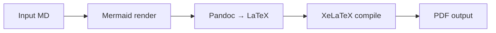

# LaTeX Document Templates

## master-thesis

**Based on:** a standard Norwegian university master-thesis layout  
**Font:** Times New Roman 12pt, 1.5× line spacing  
**Layout:** A4, 150×245mm text block, fancyhdr (page number centred at bottom)  
**Structure:** Title page → Abstract → TOC → List of Figures → List of Tables → Body → Bibliography → Appendix  
**Bibliography:** biblatex / biber, APA style  
**Best for:** Academic papers, theses, formal research reports

**Pandoc front-matter keys:**

```yaml
---
title: "My Thesis Title"
subtitle: "Master of Financial Economics" # shown above title rule
author:
  - Author Name
  - Co-author Name
date: "Spring 2025"
abstract: "One paragraph abstract goes here."
logo: "path/to/university-logo.pdf" # optional
bibliography: refs.bib # optional
---
```

---

## whitepaper

**Font:** Georgia 11pt (serif body), Arial (sans headings), 1.3× spacing  
**Layout:** A4, 25/25/28/28mm margins  
**Cover:** Dark navy banner with white title + author + date (TikZ overlay)  
**Sections:** Bold coloured headings with thin rule underline  
**Abstract:** Framed box immediately after cover  
**Best for:** Industry whitepapers, research reports, strategy documents, project proposals

**Pandoc front-matter keys:**

```yaml
---
title: "Whitepaper Title"
subtitle: "Optional subtitle"
author:
  - First Author
  - Second Author
date: "March 2025"
abstract: "Executive summary paragraph."
logo: "path/to/logo.png" # appears in top-right of cover
toc: true # include table of contents
bibliography: refs.bib
---
```

---

## minimal

**Font:** Latin Modern Roman 11pt (standard LaTeX look), clean  
**Layout:** A4, 30mm uniform margins  
**Cover:** Centred title block (no fancy title page)  
**Best for:** Technical notes, memos, quick reports, internal documents

**Pandoc front-matter keys:**

```yaml
---
title: "Document Title"
subtitle: "Optional"
author:
  - Name
date: "2025-03-02"
abstract: "Optional short abstract."
toc: true
bibliography: refs.bib
---
```

---

## Mermaid Diagrams

Any `mermaid ... ` block in the Markdown is automatically rendered to PNG
before LaTeX compilation. Example:

````markdown

````

Requires: `mmdc` (`npm i -g @mermaid-js/mermaid-cli`) or available via `npx`.  
If rendering fails, the block is preserved as verbatim code in the PDF.

---

## Math

Standard LaTeX math works via pandoc's `+tex_math_dollars` extension:

- Inline: `$E = mc^2$`
- Display: `$$\hat{\beta} = (X^TX)^{-1}X^Ty$$`

---

## Citations

With `--bib refs.bib`, cite using pandoc syntax:  
`[@author2021]` → (Author, 2021) in APA style.

---

## Build command reference

```bash
python3 build.py input.md --template whitepaper --output report.pdf
python3 build.py paper.md --template master-thesis --bib refs.bib --toc
python3 build.py note.md  --template minimal --output /tmp/note.pdf
python3 build.py study.md --template whitepaper --logo logo.png --bib refs.bib --toc --keep-tex
```
